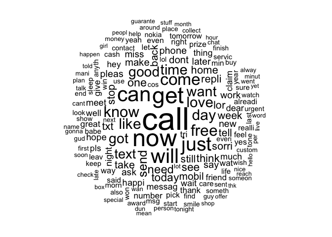
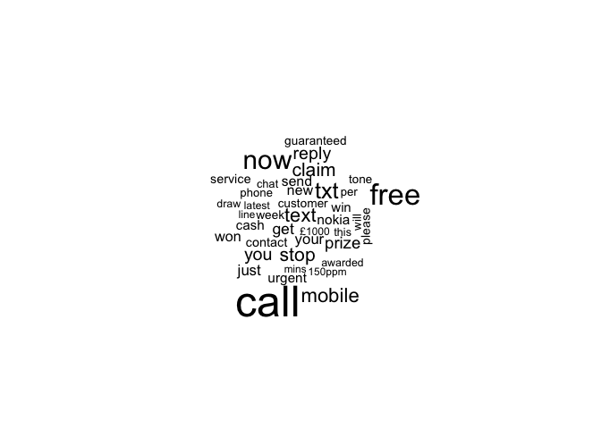
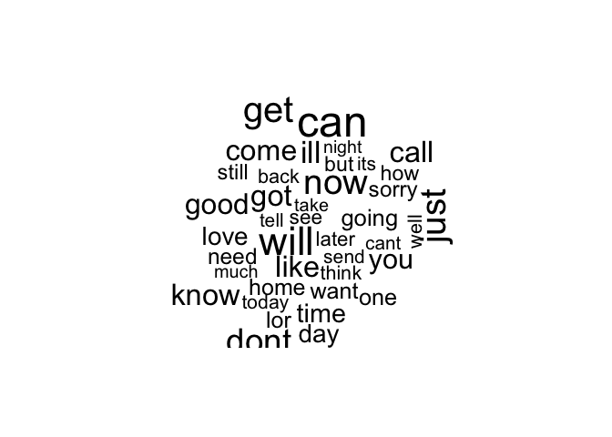

Spam Texts using Naive Bayes Algorithm
================
Lucas Argeles
7/16/2021

``` r
if (!require('tidyverse')) 
{
  install.packages('tidyverse');
  library(readr);
}
```

    ## Loading required package: tidyverse

    ## ── Attaching packages ─────────────────────────────────────── tidyverse 1.3.1 ──

    ## ✓ ggplot2 3.3.3     ✓ purrr   0.3.4
    ## ✓ tibble  3.1.0     ✓ dplyr   1.0.5
    ## ✓ tidyr   1.1.3     ✓ stringr 1.4.0
    ## ✓ readr   1.4.0     ✓ forcats 0.5.1

    ## ── Conflicts ────────────────────────────────────────── tidyverse_conflicts() ──
    ## x dplyr::filter() masks stats::filter()
    ## x dplyr::lag()    masks stats::lag()

``` r
if(!require('tm'))
{
  install.packages('tm');
  library(tm)
}
```

    ## Loading required package: tm

    ## Loading required package: NLP

    ## 
    ## Attaching package: 'NLP'

    ## The following object is masked from 'package:ggplot2':
    ## 
    ##     annotate

``` r
if(!require('SnowballC'))
{
  install.packages('SnowballC');
  library(SnowballC)
}
```

    ## Loading required package: SnowballC

``` r
if(!require('wordcloud'))
{
  install.packages('wordcloud');
  library(wordcloud);
}
```

    ## Loading required package: wordcloud

    ## Loading required package: RColorBrewer

``` r
if(!require('e1071'))
{
  install.packages('e1071');
  library(e1071);
}
```

    ## Loading required package: e1071

``` r
if(!require('gmodels'))
{
  install.packages('gmodels')
  library(gmodels)
}
```

    ## Loading required package: gmodels

Here, we use the data adapted from the SMS Spam Collection found
[here](http://www.dt.fee.unicamp.br/~tiago/smsspamcollection/).  
<br> The data includes two column: whether the message was spam or not
(ham) and the message itself. Our job is to create a model that can
effectively sort through the messages.  
<br> First, we import the data into our environment.

``` r
sms_raw <- read.csv("sms_spam.csv", stringsAsFactor = FALSE)
str(sms_raw)
```

    ## 'data.frame':    5559 obs. of  2 variables:
    ##  $ type: chr  "ham" "ham" "ham" "spam" ...
    ##  $ text: chr  "Hope you are having a good week. Just checking in" "K..give back my thanks." "Am also doing in cbe only. But have to pay." "complimentary 4 STAR Ibiza Holiday or £10,000 cash needs your URGENT collection. 09066364349 NOW from Landline "| __truncated__ ...

We can see 5559 observations across two columns. Because the **type**
column is a character column, we convert it into a factor.

``` r
sms_raw$type <- factor(sms_raw$type)
str(sms_raw$type)
```

    ##  Factor w/ 2 levels "ham","spam": 1 1 1 2 2 1 1 1 2 1 ...

``` r
table(sms_raw$type) # here we can see how many texts are spam and how many are ham
```

    ## 
    ##  ham spam 
    ## 4812  747

The next step is converting the text into a corpus so that we can
analyze the data later on.

``` r
sms_corpus <- VCorpus(VectorSource(sms_raw$text))
```

We then standardize the text so that world like Hey!, HEY, and hey are
understood as the same words to the computer. We also remove all numbers
since they are not relevant to this analysis.

``` r
sms_corpus_clean <- tm_map(sms_corpus, content_transformer(tolower))
as.character(sms_corpus_clean[[1]]) # check if text was converted correctly
```

    ## [1] "hope you are having a good week. just checking in"

``` r
sms_corpus_clean <- tm_map(sms_corpus_clean, removeNumbers)
```

Afterwards, we remove all stop words and punctuation that could lead our
analysis to be erroneous.

``` r
sms_corpus_clean <- tm_map(sms_corpus_clean, removeWords, stopwords())
sms_corpus_clean <- tm_map(sms_corpus_clean, removePunctuation)
```

In order for words such as learn, learned, and learning to be treated as
the same we need to use a stemming function so that the computer doesn’t
treat them as separate words.

``` r
sms_corpus_clean <- tm_map(sms_corpus_clean, stemDocument)
```

All that is left to remove is the unnecessary white spacing.

``` r
sms_corpus_clean <- tm_map(sms_corpus_clean, stripWhitespace)
```

Next, we tokenize the words.

``` r
sms_dtm <- DocumentTermMatrix(sms_corpus_clean)
sms_dtm2 <- DocumentTermMatrix(sms_corpus, control = list(tolower = TRUE,
            removeNumbers = TRUE, stopwords = TRUE, removePunctuation = TRUE,
            stemming = TRUE)) # another method to do the aforementioned steps
```

We then split the dataset into a training set and a testing set. We will
divide the first 75% into the training set and the remaining 25% into
the testing set.

``` r
sms_dtm_train <- sms_dtm[1:4169,]
sms_dtm_test <- sms_dtm[4170:5559,]
```

Because the labels aren’t stored in the dtm set, we need to import them
from the raw set. Then we compare the proportions with the training and
testing sets.

``` r
sms_train_labels <- sms_raw[1:4169, ]$type
sms_test_labels <- sms_raw[4170:5559,]$type
prop.table(table(sms_train_labels))
```

    ## sms_train_labels
    ##       ham      spam 
    ## 0.8647158 0.1352842

``` r
prop.table(table(sms_test_labels))
```

    ## sms_test_labels
    ##       ham      spam 
    ## 0.8683453 0.1316547

Because each contain about 13% spam, we can conclude that the datasets
were evenly distributed.  
<br> We use a wordcloud to visualize the frequency of words that appear
throughout the texts. This will create a word cloud from our prepared
SMS corpus. Since we specified random.order = FALSE, the cloud will be
arranged in a nonrandom order with higher frequency words placed closer
to the center. If we do not specify random.order, the cloud would be
arranged randomly by default. The min.freq parameter specifies the
number of times a word must appear in the corpus before it will be
displayed in the cloud. Since a frequency of 50 is about 1 percent of
the corpus, this means that a word must be found in at least 1 percent
of the SMS messages to be included in the cloud.

``` r
wordcloud(sms_corpus_clean, min.freq = 50, random.order = FALSE)
```

<!-- -->
Now we separate the spam and ham in order to visualize the different
words in each.

``` r
spam <- subset(sms_raw, type=="spam")
ham <- subset(sms_raw, type=="ham")
wordcloud(spam$text, max.words = 40, scale =c(3, .5))
```

<!-- -->

``` r
wordcloud(ham$text, max.words = 40, scale = c(3, .5))
```

<!-- -->
<br> Because a lot of these matrices have many features, not every word
will be used in the Naive Bayes classier. In order to reduce the amount
of words we will remove any words than appear five time or less and keep
the words that appear more than five times.

``` r
sms_freq_words <- findFreqTerms(sms_dtm_train, 5)
```

The dtm vectors now need to be adjusted and filtered with the words that
appear in the frequent lists.

``` r
sms_dtm_freq_train <- sms_dtm_train[,sms_freq_words]
sms_dtm_freq_test <- sms_dtm_test[,sms_freq_words]
```

Since the Naive Bayes model uses data with categorical features, we need
to adjust the datasets to carry categories.

``` r
convert_counts <- function(x){x<-ifelse(x > 0, "Yes", "No")}
```

To apply this to our dataset, we use the apply() function. This uses a
MARGIN parameter to specify either rows or columns. 1 is for rows and 2
is for columns.

``` r
sms_train <- apply(sms_dtm_freq_train, MARGIN = 2, convert_counts)
sms_test <- apply(sms_dtm_freq_test, MARGIN = 2, convert_counts)
```

Now we are able to use the Naive Bayes model.

``` r
sms_classifier <- naiveBayes(sms_train, sms_train_labels)
```

We now use the sms\_classifer to make predictions on unseen data (in
this case, the training dataset).

``` r
sms_test_pred <- predict(sms_classifier, sms_test)
```

Finally, we compare the predictions to the true values.

``` r
CrossTable(sms_test_pred, sms_test_labels, prop.chisq = FALSE, prop.t = FALSE, dnn = c('predicted','actual'))
```

    ## 
    ##  
    ##    Cell Contents
    ## |-------------------------|
    ## |                       N |
    ## |           N / Row Total |
    ## |           N / Col Total |
    ## |-------------------------|
    ## 
    ##  
    ## Total Observations in Table:  1390 
    ## 
    ##  
    ##              | actual 
    ##    predicted |       ham |      spam | Row Total | 
    ## -------------|-----------|-----------|-----------|
    ##          ham |      1201 |        30 |      1231 | 
    ##              |     0.976 |     0.024 |     0.886 | 
    ##              |     0.995 |     0.164 |           | 
    ## -------------|-----------|-----------|-----------|
    ##         spam |         6 |       153 |       159 | 
    ##              |     0.038 |     0.962 |     0.114 | 
    ##              |     0.005 |     0.836 |           | 
    ## -------------|-----------|-----------|-----------|
    ## Column Total |      1207 |       183 |      1390 | 
    ##              |     0.868 |     0.132 |           | 
    ## -------------|-----------|-----------|-----------|
    ## 
    ## 

Looking at the table, we can see that a total of only 6 + 30 = 36 of the
1,390 SMS messages were incorrectly classified (2.6 percent). Among the
errors were 6 out of 1,207 ham messages that were misidentified as spam,
and 30 of the 183 spam messages were incorrectly labeled as ham.
Considering the little effort we put into the project, this level of
performance seems quite impressive. This case study exemplifies the
reason why Naive Bayes is the standard for text classification; directly
out of the box, it performs surprisingly well.  
<br> On the other hand, the six legitimate messages that were
incorrectly classified as spam could cause significant problems for the
deployment of our filtering algorithm, because the filter could cause a
person to miss an important text message. We should investigate to see
whether we can slightly tweak the model to achieve better performance.
To do so, we will tweak the Laplace estimator.

``` r
sms_classifier2 <- naiveBayes(sms_train, sms_train_labels, laplace = 1)
sms_test_pred2 <- predict(sms_classifier2, sms_test)
CrossTable(sms_test_pred2, sms_test_labels, prop.chisq = FALSE, prop.t = 
             FALSE, prop.r = FALSE, dnn = c('predicted', 'actual'))
```

    ## 
    ##  
    ##    Cell Contents
    ## |-------------------------|
    ## |                       N |
    ## |           N / Col Total |
    ## |-------------------------|
    ## 
    ##  
    ## Total Observations in Table:  1390 
    ## 
    ##  
    ##              | actual 
    ##    predicted |       ham |      spam | Row Total | 
    ## -------------|-----------|-----------|-----------|
    ##          ham |      1189 |        16 |      1205 | 
    ##              |     0.985 |     0.087 |           | 
    ## -------------|-----------|-----------|-----------|
    ##         spam |        18 |       167 |       185 | 
    ##              |     0.015 |     0.913 |           | 
    ## -------------|-----------|-----------|-----------|
    ## Column Total |      1207 |       183 |      1390 | 
    ##              |     0.868 |     0.132 |           | 
    ## -------------|-----------|-----------|-----------|
    ## 
    ## 

This time around, we seemed to have less messages that were predicted as
ham but were actually spam. The major down fall is we had more messages
that were predicted as spam but were actually ham. This poses a problem
for the system when filtering out the messages because this means that
people are not getting the messages that they are supposed to get. It is
less of a problem if users happen to receive spam messages as compared
to if they are not getting messages from friends, family, or other
correspondents.  
<br> **Bottom Line** The model was ultimately able to correctly sort
through 97% of the messages correctly, making this a pretty effective
machine learning model.
